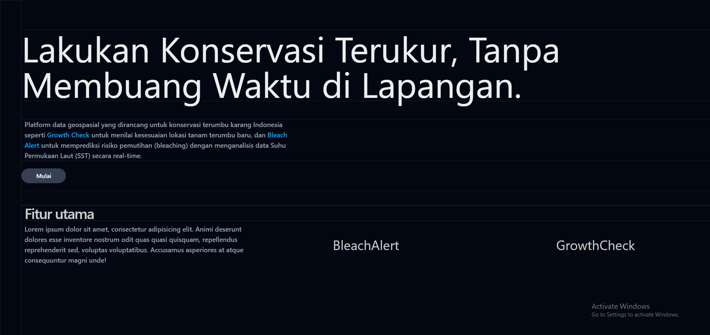
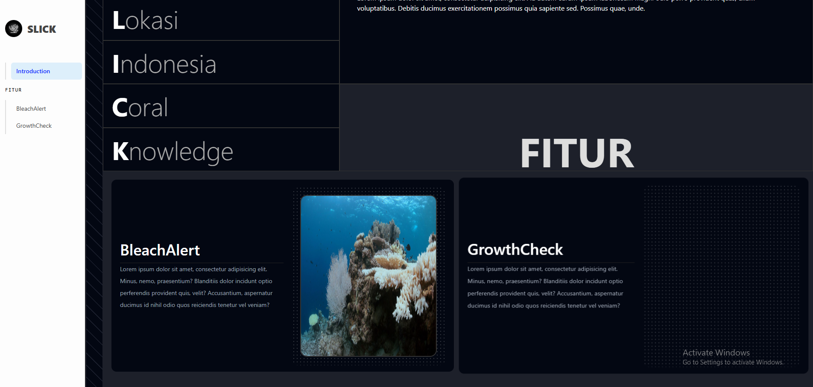

# SLICK

SLICK adalah singkatan dari **Suhu, Lokasi, Indonesia, Coral Knowledge**.  
Sebuah konsep aplikasi berbasis web yang dirancang untuk menyajikan informasi kelautan secara sederhana, informatif, dan mudah diakses.

---

## Apa itu SLICK?
SLICK bertujuan untuk menghadirkan data kelautan seperti:
- Suhu laut (Sea Surface Temperature / SST)
- Lokasi (geolokasi dan posisi pemantauan)
- Indonesia sebagai fokus wilayah kelautan tropis
- Coral Knowledge atau pengetahuan tentang terumbu karang

Dengan adanya SLICK, informasi kelautan dapat disajikan secara real-time, ringkas, dan ramah pengguna.  
Hal ini diharapkan membantu masyarakat, akademisi, maupun pengambil kebijakan dalam memahami kondisi laut Indonesia dan mendorong keterlibatan aktif dalam menjaga sumber daya laut.

---

## Fitur Utama
- BleachAlert → Pemantauan resiko pemutihan terumbu karang (_coral bleaching_)
- GrowthCheck → Penentuan lokasi penanaman terumbu karang
- Geolocation Mapping → Integrasi peta interaktif dengan data kelautan

---

## Teknologi
- [Tailwind CSS](https://tailwindcss.com/) → Styling cepat & responsif  
- [Leaflet.js](https://leafletjs.com/) → Peta interaktif  
- [JavaScript](https://developer.mozilla.org/docs/Web/JavaScript) → Logika aplikasi  
- [HTML5](https://developer.mozilla.org/docs/Web/HTML) → Struktur halaman  

---

## Preview

### Beranda


### Pendahuluan


---

## Instalasi
1. Clone repository:
   ```bash
   git clone https://github.com/username/slick.git
